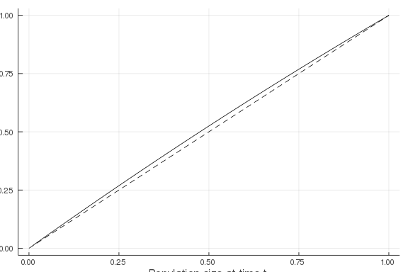
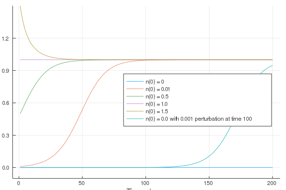
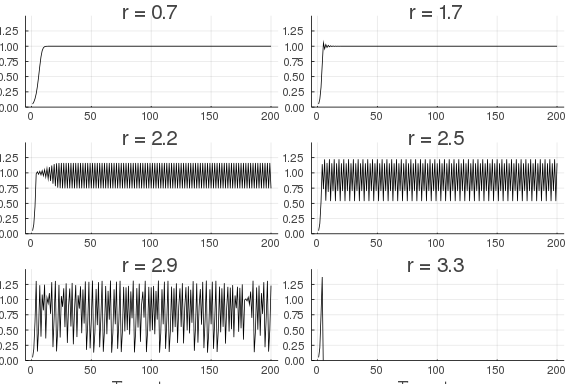
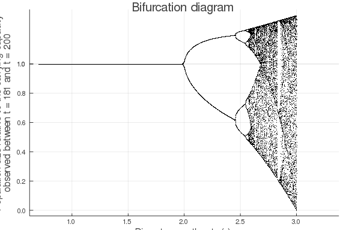

# Introduction

The logistic model of population growth in discrete time describes the variation on the size of a population that is under competition (resources are limited). This model, though one of the simplest in Ecology, can lead to complex patterns of population dynamics. These different patterns arise when we vary the population growth rate $r$, whose raise can change the pattern of populational size sustained at the equilibrium point for a pattern of oscillation around this point, a chaotic dynamics or even the extinction of the population. This last result may sound counterintuitive, as we would not expect a greater extinction probability for populations with elevated growth rates. 

Starting from the logistic model of growth, we will (i) propose an analysis to show how we can find a value of the growth rate $r$ after which the population cannot persist and (ii) plot the bifurcation diagram of the logistic model to show that there is indeed a maximal growth rate after which the system becomes unstable.

## Required packages


````julia
using Plots
````


## Model description and justification

We want to model the dynamics of a population under competition, which can be given by a linear density dependence (each individual added to the population causes and incremental decrease in the per capita rate of population growth). The population size at time t+1 $n(t+1)$ corresponds to the population size at the previous time $n(t)$ added by the product of $n(t)$, the population discrete growth rate $r$ and the relative distance between $n(t)$ and the maximum population size supported $K$, i.e., the carrying capacity (which here is established as 1).

$$n(t+1) = n(t) + r\times n(t)\times \left(1-\frac{n(t)}{K}\right), K = 1$$

Given a positive $r$, when $n(t)$ is lesser than $1$, $(1-n(t))$ is positive and the population grows, and when $n(t)$ is greater than $1$, $(1-n(t))$ is negative and the population shrinks. When $n(t)$ is $1$, the whole term added to $n(t)$ equals to zero and the population size remains the same.  


````julia
###### Generating model function

function f(n::Float64, r::Float64) # f is a function with parameters n and r that accept non-integer values as input
  return n + n*r*(1.0-n) # the f function returns n(t+1), given by the equation above
end # ends the function
````


````
f (generic function with 1 method)
````


## Model analysis

### Equilibrium identification

The values of $n$ for which the population is in equilibrium ($\hat n$) can be found when $n(t+1) = n(t)$, as this is a discrete time model. So, the equilibrium condition is given by $$\hat n = \hat n + \hat n \times r \times (1-\hat n ),$$ which simplifies to $$\hat n \times r \times (1-\hat n ) = 0.$$

From this last equation, we can can get to two different equilibrium values for $n$:

$$ \hat n_1 = 0$$ and $$ \hat n_2 = 1.$$

Both of these equilibrium states have biological meaning, as when there is no individual in the population as an initial condition ($ n(t) = 0$), there is no way for the population to grow, and on the following time steps $n$ would remain on zero. With respect to $ \hat n = 1$, this equilibrium state refers to the carrying capacity, i.e. the maximum size for which population would not decline.  


### Feasibility/Existence Conditions 

For the equilibrium points to be able to occur in real biological systems, they have to be equal or greater than zero ($\hat n >= 0 $). This is true for both of them, as $ \hat n_1 = 0$ and $ \hat n_2 = 1$.

### Stability analysis

To analyse the stability of $ \hat n_1 = 0$ and $ \hat n_2 = 1$, we add a deviation $\epsilon$ to these $ \hat n $ states of equilibrium in such a way that $ n(t) = \hat n + \epsilon(t)$. To explore if $\hat n$ are stable or unstable, we want to know if $\epsilon(t+1)$ grows (indicating unstability) or shrinks (indicating stability) over time.
By definition, $$\epsilon(t+1) = n(t+1) - \hat n.$$ As the model analysed is a recursion model, $$\epsilon(t+1) = f(n(t)) - \hat n,$$ which can be rewritten as $$\epsilon(t+1) = f(\hat n + \epsilon(t)) - \hat n.$$ As $\epsilon(t) \approx 0$, we can use the first and the second term of the Taylor series for $f(\hat n + \epsilon(t))$ and get to $$\epsilon(t+1) = f(\hat n) + \lambda \times \epsilon(t) - \hat n,$$ where $\lambda$ is $\frac{df}{dn}|_{n=\hat n}$ and is equivalent to the slope of the recursion line at the equilibrium points $\hat n$ on the $n(t+1)$  x  $n(t)$ plot. 
In the equilibrium, $f(\hat n) = \hat n$ (recursion model), so $\epsilon(t+1) = \lambda \times \epsilon(t)$. Integrating to $\epsilon(t)$, we get that $$\epsilon(t) = \lambda ^{t} \times \epsilon(t_0).$$
So, for a given $\hat n$, if $|\lambda|$ is greater than 1, $\epsilon(t)$ grows as $t$ gets larger, and the equilibrium is unstable. if $|\lambda|$ is lesser than 1, $\epsilon(t)$ shrinks as $t$ gets larger, and the equilibrium is stable.
To analize the stability of $ \hat n_1 = 0$ and $ \hat n_2 = 1$, we can plot the $n(t+1)$  x  $n(t)$ graph for a given model simulation and visually identify if the slope of the recursion line is greater or lesser than $|1|$.

````julia
###### Generating simulations

r = 0.1 # sets the r value used in the simulations

n = zeros(Float64, 200, 6) # creates an array with 200 lines and 6 columns to save the simulations results (5 population simulations over 200 time steps)
n[1,1] = 0.0 # sets n0 as 0 for the first simulation 
n[1,2] = 0.01 # sets n0 as 0.01 for the second simulation 
n[1,3] = 0.5 # sets n0 as 0.5 for the third simulation 
n[1,4] = 1.0 # sets n0 as 1.0 for the forth simulation 
n[1,5] = 1.5 # sets n0 as 1.5 for the fifth simulation
n[1,6] = 0.0 # sets n0 as 0.0 for the sixth simulation
n[100,6] = 0.001 # adds a perturbation of size 0.001 at time 100 on the sixth simulation

for i in 1:size(n,2) # creates a loop that goes from 1 to 6 (number of population simulations)
    for t in 1:size(n,1)-1 # creates a loop that goes from 1 to 199 (number of time iterations for each population simulation)
        if n[t+1,i] == 0.0 # creates a condition: if n(t+1) equals zero
            n[t+1,i] = f(n[t,i],r) # applies the f function (the logistic model) - with the r value set before - for each simulation i on the population size at time t (n[t,i]) and saves the result on n[t+1,i]
        else # if n(t+1) is different from zero (as when there is a perturbation set for the next time step)
            n[t+1,i] = f(n[t,i],r) + n[t+1,i] # applies the f function on n(t) and adds to the perturbation set for the next time step to sum up the initial n for the next iteration 
        end # ends the condition expression
    end # ends the time iteration loop
end # ends the population simulation loop

###### Choosing simulation values to do the n(t+1) x n(t) plot

nt0 = n[1:199,2] # takes the n(t) values from all time iterations for the population simulation that started with n0 = 0.01 (the second simulation)
nt1 = n[2:200,2] # takes the n(t+1) values from all time iterations for the population simulation that started with n0 = 0.01 (the second simulation)

###### Generating the n(t+1) x n(t) plot for the n0 = 0.01 simulation

plot(nt0,nt1,color=:black,xlabel="Population size at time t", ylabel="Population size at time t+1") # generates the graph by plotting n(t+1) (specified by nt1) against n(t) (specified by nt0)
plot!([0.0,1.0],[0.0,1.0],legend=false,ls=:dash,color=:black) # plots the reference line that indicates n(t+1) = n(t)
````





From the previous plot (simulation with $r=0.1$ and $n_0=0.01$), we can see that the slope of the recursion line for $\hat n = 0$ is greater than 1 (as the diagonal dashed line slope equals to 1), so this equilibrium point is unstable. On the other hand, the slope of the recursion line for $\hat n = 1$ is lesser than 1, indicating a stable equilibrium point.

We can also visualize these stability properties by plotting a *Population size x Time* plot for simulations with different values for the initial population size $n_0$.

````julia
###### Plotting n(t) against time t for all population simulations

plot(n[:,1],legend=:right,ylims=(-0.1,1.5),xlabel="Time steps",ylabel="Population size relative to the carrying capacity",label="n(0) = 0") # plots n(t) x t for population 1
plot!(n[:,2],label="n(0) = 0.01") # plots n(t) x t for population 2 on the same graph
plot!(n[:,3],label="n(0) = 0.5") # plots n(t) x t for population 3 on the same graph
plot!(n[:,4],label="n(0) = 1.0") # plots n(t) x t for population 4 on the same graph
plot!(n[:,5],label="n(0) = 1.5") # plots n(t) x t for population 5 on the same graph
plot!(n[:,6],label="n(0) = 0.0 with 0.001 perturbation at time 100") # plots n(t) x t for population 6 on the same graph
````





The populations that had $n_0$ different from zero have maintained, grown or fallen to the equilibrium point $\hat n = 1$, demonstrating its stability. On the other hand, the population that had $n_0$ equal to zero maintained this value over time. The population with $n_0$ close to zero ($n_0$ = 0.01) had moved away from the equilibrium point $\hat n = 0$, as well as the population with zero $n_0$ submitted to a 0.001 perturbation at time 100, giving a demonstration of the $\hat n = 0$ unstability.

## Simulations

To explore the effect of $r$ value variation on population dynamics and persistence, we will recursively apply the discrete logistic model function on populations that start with $n(t)=0.05$ and that have values of growth rate that goes from $r=0.7$ to $r=3.3$ (steped by 0.001, totaling 2.601 simulations). For each simulation, we will iterate 200 time steps, and plot the last 20 population size values on a *Population size x r value* plot (bifurcation diagram).

We will first set the initial conditions for the parameters $r$ and $n(t)$ and generate the array that will store population sizes after each iteration, for all simulations.

````julia
###### Setting initial conditions and parameters values

r = collect(0.7:0.001:3.3) # creates an array with r values that go from 0.7 to 3.3 stepped by 0.001 (totaling 2601 values)
n = zeros(Float64,200,length(r)) # creates an array with 200 lines and 2601 columns to store the simulation results
n[1,:] .= 0.05 # sets the initial size for all simulation populations as n0 = 0.05
````


````
2601-element view(::Array{Float64,2}, 1, :) with eltype Float64:
 0.05
 0.05
 0.05
 0.05
 0.05
 0.05
 0.05
 0.05
 0.05
 0.05
 ⋮   
 0.05
 0.05
 0.05
 0.05
 0.05
 0.05
 0.05
 0.05
 0.05
````


We then run the model using two loopings, one external that goes from 1 to the number of simulations runned, and the other one internal that cycles time iterations for each simulation.

````julia
###### Running the model

for i in 1:length(r) # creates a loop that goes from 1 to the number of different r values (2601), as each r value will be used for a different simulation 
    for t in 1:(size(n,1)-1)  # creates a loop that goes from 1 to 199 (number of time iterations for each population simulation)
        n[t+1,i] = f(n[t,i],r[i]) # applies the f function (the logistic model) - with a specific r value from the r array - for each simulation i on the population size at time t (n[t,i]) and saves the result on n[t+1,i]
    end # ends the time iteration loop
end # ends the population simulation loop
````


We can take a look at the different types of population dynamic that arose within the simulations.

````julia
###### Plotting n(t) against time t for population simulations with different r values

p1 = plot(n[:,1],ylims=(0.0,1.5),title="r = 0.7", legend=false,c=:black)
p2 = plot(n[:,1001],ylims=(0.0,1.5),title="r = 1.7", legend=false,c=:black)
p3 = plot(n[:,1501],ylims=(0.0,1.5),title="r = 2.2", ylabel="Population size relative to the carrying capacity", legend=false,c=:black)
p4 = plot(n[:,1801],ylims=(0.0,1.5),title="r = 2.5", legend=false,c=:black)
p5 = plot(n[:,2201],ylims=(0.0,1.5),title="r = 2.9", xlabel="Time steps", legend=false,c=:black)
p6 = plot(n[:,2601],ylims=(0.0,1.5),title="r = 3.3", xlabel="Time steps", legend=false,c=:black)
plot(p1,p2,p3,p4,p5,p6,layout=(3,2),legend=false)
````





With smaller but positive growth rates, population size increases until it reaches the equilibrium $ \hat n = 1$. As $n(t+1)$ is determined by $n(t)$ and $r$, the number of individuals $n(t+1)$ can exceed the carrying capacity with greater growth rates when $n(t)$ is smaller than 1, as well as it can get bellow the carrying capacity value when $n(t)$ is greater than 1. This way, a pattern of oscillation around the carrying capacity arises with elevated values of $r$, and as $r$ increases so does the oscillation amplitude. This aplitude rise can make the population size touches zero and becomes extinct.
Finally we plot the last 20 population size values against the r value used in the simulation, for all simulations runned. When, in a given simulation, population size reached an stationary equilibrium, all the 20 points will have the same value and will overlap on the plot.

````julia
##### Plotting the bifurcation diagram

scatter(r,transpose(n[181:200,:]),title="Bifurcation diagram",xlabel="Discrete growth rate (r)", ylabel="Population size relative to the carrying capacity\nobserved between t = 181 and t = 200",legend=false, markersize=0.5 ,c=:black)
````





From the bifurcation diagram, we can see that growth rate values smaller than 2.0 generate dynamics in which populations reach and stay at the equilibrium $ \hat n = 1$ (or oscillate for some time and then stabilize). From $r$ = 2.0 to $r$ about 2.4, increased amplitude oscillation patterns with 2 peaks arise, which transforms into oscillations with 4 peaks between $r$ = 2.4 and $r$ = 2.6 approximately. From this value to $r$ = 3, oscillations with greater number of peaks arise and also chaotic dynamics, with no regular oscillations. For $r$ greater than 3.0, oscillations amplitude gets to big to sustain the population, which eventually reachs zero and becomes extinct.

## Conclusions

For discrete time models, populations experiecing competition that have abundances different from the equilibrium size defined by the carrying capacity $K$ may or may not reach and stick to this size depending on their growth rates. As the population abundance on a giving time step depends on the its variation from the previous time step abundance, populations sizes can cross the carrying capacity and reach greater or lower values. This happens since there is no mechanism prevanting populations sizes to cross the equilibrium value, even if once this crossing takes place the orientantion of population growth will change.
As $r$ growth rate value gets greater, the variation on population sizes from one time step to another also increases. As a consequence, the population abundance can cross and oscillate indefinitely around the carrying capacity value. However, if $r$ value gets too large, the population size variation can exceed population size itself, leading to its extinction.
