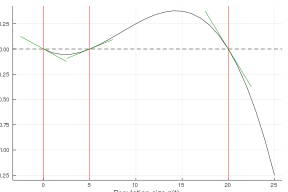
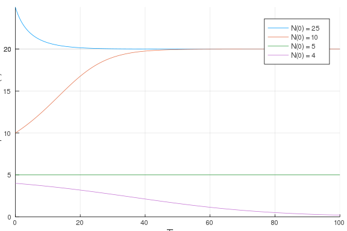
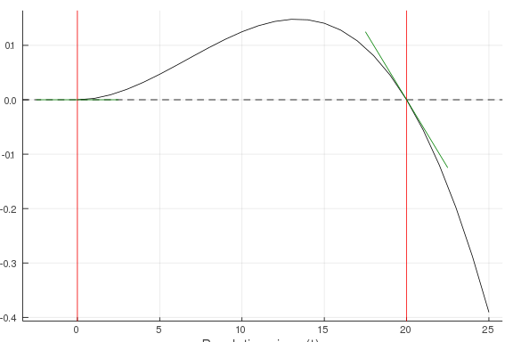
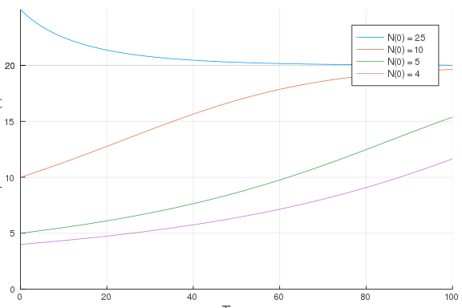

# Introduction

Allee effect is a positive association between the fitness of an individual and its population size over some interval, which generally occurs at small sized population ranges. This can happen by a decrease on birth rate or an increase on death rate when population size gets smaller. For example, some animals can hunt, reproduce and care for their offspring more efficiently in big groups than they can by themselves or in smaller groups. Moreover, sometimes the presence of multiple individuals of a given plant species can alter environmental conditions in favorable ways for its juveniles to settle and grow. The Alle effect is thus characterized by a reduced population growth at low densities. 

This reduction may or may not give rise to a critical population size below which the population cannot persist. Allee effect that generates a critical population size is called strong, while Allee effect that do not result in critical sizes is called weak.

Although the Allee effect creates a positive density dependance at reduced population sizes, there can still be the intraspecific competition effect generating a negative density dependance at greater population sizes.

In this work, we will explore the relation between population growth rates and population sizes for populations under both the intraspecific competition and the Allee effect. Using the strong and the weak Allee effect models, we will find the equilibrium population sizes and verify that populations starting on different sides of the equilibrium points do end up where they are predicted.

## Required packages


````julia
using Plots
using DifferentialEquations
````


## Model description and justification

We will implement the Allee effect starting from the logistic growth model of population dynamics:

$$\frac{\text{d}}{\text{d}t}n = n\times r\times \left(1-\frac{n}{K}\right),$$

where $n$ is the population size at time $t$, $r$ is the population intrinsec growth rate and $K$ is the carrying capacity, i. e., the maximum population size supported. $\frac{\text{d}}{\text{d}t}n$ is the population growth rate (as a continuous time model).

### Strong Allee effect model

To model the strong Allee effect, we can add the multiplying term $(\frac{n}{A}-1)$ to the previous equation:

$$\frac{\text{d}}{\text{d}t}n = n\times r\times \left(\frac{n}{A}-1\right)\times \left(1-\frac{n}{K}\right),$$

where $A$ is the size bellow which population is not viable (i.e., bellow which the population growth rate $\frac{\text{d}}{\text{d}t}n$ gets negative). When $n$ > $A$ the $(\frac{n}{A}-1)$ term is positive, while it gets negative when $n$ < $A$ and null when $n$ = $A$.

### Weak Allee effect model

To model the weak Allee effect, we can add the multiplying term $(\frac{n}{K})$ to the original logistic equation:

$$\frac{\text{d}}{\text{d}t}n = \frac{r}{K}n^2\times \left(1-\frac{n}{K}\right).$$

This way, as $n$ gets closer to zero, the term $(\frac{n}{K})$ gets smaller and the total population growth rate $\frac{\text{d}}{\text{d}t}n$ decreases. With a weak Alle effect, there is no population size threshold bellow which $\frac{\text{d}}{\text{d}t}n$ is negative. 

## Model analysis

### Equilibrium identification

The values of $n$ for which the population is in equilibrium ($\hat n$) can be found when $\frac{\text{d}}{\text{d}t}n$ = 0 for both models, as they are continuous time models.

#### Strong Allee effect

The equilibrium condition is given by $$\hat n\times r\times \left(\frac{\hat n}{A}-1\right)\times \left(1-\frac{\hat n}{K}\right) = 0.$$

From this equation, we can can get to three different equilibrium values: $\hat n_1 = 0$, $\hat n_2 = A$ and $\hat n_3 = K$.

#### Weak Allee effect

The equilibrium condition is given by $$\frac{r}{K}\hat n^2\times \left(1-\frac{\hat n}{K}\right) = 0.$$

From this equation, we can can get to two different equilibrium values: $\hat n_1 = 0$ and $\hat n_2 = K$.

### Feasibility/Existence Conditions 

For the equilibrium points to be able to occur, they have to be equal or greater than zero ($\hat n >= 0 $). This is true for all $\hat n$ in both models, as $A$ and $K$ are population size values.

### Stability analysis

To analyse the stability of $\hat n$, we add a deviation $\epsilon$ to the $ \hat n $ states of equilibrium in such a way that $ n(t) = \hat n + \epsilon(t)$. To explore if $\hat n$ are stable or unstable, we want to know if $\epsilon(t+1)$ grows (indicating unstability) or shrinks (indicating stability) over time.
By definition, $\frac{d}{dt}\epsilon = \frac{d}{dt}(n(t)-\hat n)$, which can be simplified to $\frac{d}{dt}\epsilon = \frac{d}{dt}(n(t))$ as $\hat n$ is a constant. As the analysed models are continuous time models, $\frac{d}{dt}\epsilon = f(n(t))$, which can be rewritten as $\frac{d}{dt}\epsilon = f(\hat n + \epsilon(t))$. As $\epsilon(t) \approx 0$, we can use the first and the second term of the Taylor series for $f(\hat n + \epsilon(t))$ and get to $\frac{d}{dt}\epsilon = r \times \epsilon (t)$ where $r$ is $\frac{df}{dn}|_{n=\hat n}$ and represents the slope of the differential equation with respect to $n$ evaluated at the equilibrium points $\hat n$. The solution to this equations results in $\epsilon (t) \approx e^(rt) \epsilon(0)$. So, for a given $\hat n$, if $r$ > 0, $\epsilon(t)$ grows as $t$ gets larger, and the equilibrium is unstable. If $r$ < 0, $\epsilon(t)$ shrinks as $t$ gets larger, and the equilibrium is stable.

To analize the stability of $ \hat n_1 = 0$, $ \hat n_2 = A$ and $ \hat n_3 = K$ for the strong Allee effect model and the stability of $ \hat n_1 = 0$ and $ \hat n_2 = K$ for the weak Allee effect model, we can plot the $\frac{d}{dt}(n(t))$  x  $n(t)$ graph for a given model simulation and visually identify if the slope $r$ of the lines at the $\hat n$ points are greater or lesser than zero. We will do it on the next section.

## Simulations

To be able to do the $\frac{d}{dt}(n(t))$  x  $n(t)$ graph, we first have to run simulations for the models, which will give us $\frac{d}{dt}(n(t))$ resulting values that we will then plot against the $n(t)$ corresponding values.

### Strong Allee effect

First we generate the strong Allee effect model.


````julia
##### Generating model function for the STRONG ALLEE EFFECT

function str_al_ef(u,p,t) # creates a function named str_al_ef with parameters u (for n(t)), p (that condensates 3 other parameters: r, K and A) and t (for time)
  r, K, A = p # the values input by p are taken as values for r, K and A (in this order)
  dn = u*r*(1.0-(u/K))*((u/A)-1.0) # model the growth rate dn/dt of a population under competition and strong Allee effect using the equation presented earlier
  return dn # returns the dn/dt value calculed above
end # ends the function
````


````
str_al_ef (generic function with 1 method)
````


Then we set the initial conditions and the parameter values that will be used on the simulations.


````julia
##### Setting initial conditions and parameter values

t=(0.,100.) # creates a tuple with the range for the time interval that will be used to integrate the model ODE
p = [0.05,20.0,5.0] # creates a vector with values for r, K and A, respectively
````


````
3-element Array{Float64,1}:
  0.05
 20.0 
  5.0
````


After that, we run the model using the initial conditions set above and plot the results.


````julia
##### Plotting the dN(T)/dT X N(T) graph

dn_vec = zeros(Float64,26) # creates a vector with 26 zero elements to store the dN/dt values
x = 0:25 # creates a sequence from 0 to 25 stepped by 1
for i in 1:26 # creates a loop from 1 to 26
  dn_vec[i] = str_al_ef(i-1, p, t) # applies the strong Allee effect function with n(t) defined by the loop index (i-1) and other parameter values set as p
end # ends the loop

plot(x, dn_vec, color=:black, xlabel="Population size n(t)", ylabel="Population growth rate dn(t)/dt",legend=false) # plots the dN(T)/dT X N(T) graph
hline!([0],ls=:dash,color=:black) # adds a dashed line for dN/dt = 0
vline!([0,5,20],color=:red) # adds one vertical red line for N(t) = 0, another for N(t) = A (here 5) and another one for N(t) = K (here 20)

##### OverPlotting the equilibrium points tangent lines

dn(u) = u*0.05*(1.0-(u/20.0))*((u/5.0)-1.0)
h = .00001
c = 5.0
m = ( dn(c + h) - dn(c) ) / h # approximative derivative
tangent_line(u) = dn(c) + m * (u - c) # equation for the tangent line

x = [2.5,7.5]
y = [tangent_line(2.5),tangent_line(7.5)]
plot!(x,y, color=:green)

c = 20.0
m = ( dn(c + h) - dn(c) ) / h # approximative derivative
x = [17.5,22.5]
y = [tangent_line(17.5),tangent_line(22.5)]
plot!(x,y, color=:green)

c = 0.0
m = ( dn(c + h) - dn(c) ) / h # approximative derivative
x = [-2.5,2.5]
y = [tangent_line(-2.5),tangent_line(2.5)]
plot!(x,y, color=:green)
````





The population sizes for which the population growth rate equals zero are the equilibrium points of the model (indicated by red vertical lines on the graph). From the graph above, we can see that the derivatives of the model function at the equilibrium points $\hat n = 0$ and $\hat n = 20$ (the carrying capacity) have negative values, making them locally stable. On the other hand, the derivative of the equilibrium point $\hat n = 5$ (the minimum viable population size) is positive, indicating its unstability. We can also see that population growth rate is negative between $n = 0$ and $n = A$ and above $n = K$. 

#### Visualizing different populations under strong Allee effect through time

We can visually verify that populations starting on different sides of the stable equilibrium points do converge to them and that populations starting close to unstable equilibrium points pull away from them. To do so, we can solve the model equation at a given time span for different initial population sizes and then plot the resulting $N(t)$ as a function of time.


````julia
##### Solving the model ODE and plotting the graphs

problem0 = ODEProblem(str_al_ef, 25.0, t, p) # presents the function str_al_ef and initial conditions for its parameters (besides the p values set before, n(0) = 25.0)
solution0 = solve(problem0) # solves the equation for the parameter values and the time interval presented above
plot(solution0,ylims=(0,25),label=("N(0) = 25"), xlabel="Time", ylabel="Population size n(t)") # plots the equation solution

problem = ODEProblem(str_al_ef,10.0,t,p) # presents the function str_al_ef and initial conditions for its parameters (besides the p values set before, n(0) = 10.0)
solution = solve(problem) # solves the equation for the parameter values and the time interval presented above
plot!(solution, label=("N(0) = 10"), xlabel="Time") # plots the equation solution

problem2 = ODEProblem(str_al_ef, 5.0, t, p) # presents the function str_al_ef and initial conditions for its parameters (besides the p values set before, n(0) = 5.0)
solution2 = solve(problem2) # solves the equation for the parameter values and the time interval presented above
plot!(solution2,label=("N(0) = 5"), xlabel="Time") # plots the equation solution

problem3 = ODEProblem(str_al_ef, 4.0, t, p) # presents the function str_al_ef and initial conditions for its parameters (besides the p values set before, n(0) = 4.0)
solution3 = solve(problem3) # solves the equation for the parameter values and the time interval presented above
plot!(solution3,label=("N(0) = 4"), xlabel="Time") # plots the equation solution
````





From the graph above, we can extract that populations with initial sizes greater than the minimum population viable size (that equals $A = 5$ for the simulations ran) reach the equilibrium state of the carrying capacity (that equals $K = 20$ for the simulations ran), which is stable, pulling away from the unstable $A$ when the initial population size is between $A$ and $K$. Besides, populations with N(0) sizes lesser than $A$ decrease towards $N=0$, a stable equilibrium point.

### Weak Allee effect

Now let's generate the weak Allee effect model.


````julia
##### Generating model function for the WEAK ALLEE EFFECT

function weak_al_ef(u,p,t) # creates a function named weak_al_ef with parameters u (for n(t)), p (that condensates 3 other parameters: r and K) and t (for time)
  r, K = p # the values input by p are taken as values for r and K (in this order)
  dn = u*r*(u/K)*(1.0-(u/K)) # model the growth rate dn/dt of a population under competition and weak Allee effect using the equation presented earlier
  return dn # returns the dn/dt value calculed above
end # ends the function
````


````
weak_al_ef (generic function with 1 method)
````


And the initial conditions and parameter values that will be used on the simulations.

````julia
##### Setting initial conditions and parameter values

t=(0.,100.) # creates a tuple with the range for the time interval that will be used to integrate the model ODE
p = [0.05,20.0] # creates a vector with values for r and K, respectively
````


````
2-element Array{Float64,1}:
  0.05
 20.0
````


Now we run the model using the initial conditions set above and plot the results.


````julia
##### Plotting the dN(T)/dT X N(T) graph

dn_vec_weak = zeros(Float64,26) # creates a vector with 26 zero elements to store the dN/dt values
x = 0:25 # creates a sequence from 0 to 25 stepped by 1
for i in 1:26 # creates a loop from 1 to 26
  dn_vec_weak[i] = weak_al_ef(i-1, p, t) # applies the Weak Allee effect function with n(t) defined by the loop index (i-1) and other parameter values set as p
end # ends the loop

plot(x, dn_vec_weak, color=:black, xlabel="Population size n(t)", ylabel="Population growth rate dn(t)/dt",legend=false) # plots the dN(T)/dT X N(T) graph
hline!([0],ls=:dash,color=:black) # adds a dashed line for dN/dt = 0
vline!([0, 20],color=:red) # adds one vertical red line for N(t) =  N(t) = K (here 20)

##### OverPlotting the equilibrium points tangent lines

dn(u) = u*0.05*(u/20.0)*(1.0-(u/20.0))
h = .00001
c = 20.0
m = ( dn(c + h) - dn(c) ) / h # approximative derivative
tangent_line(u) = dn(c) + m * (u - c) # equation for the tangent line

x = [17.5,22.5]
y = [tangent_line(17.5),tangent_line(22.5)]
plot!(x,y, color=:green)

c = 0.0
m = ( dn(c + h) - dn(c) ) / h # approximative derivative
x = [-2.5,2.5]
y = [tangent_line(-2.5),tangent_line(2.5)]
plot!(x,y, color=:green)
````





The population sizes for which the population growth rate equals zero are the equilibrium points of the model (indicated by red vertical lines on the graph). From the graph above, we can see that the derivative of the model function at the equilibrium point $\hat n = 20$ (the carrying capacity) has a negative value, making it locally stable. On the other hand, the derivative of the equilibrium point $\hat n = 0$ is null, indicating its unstability. We can also see that population growth rate is negative above $n = K$.

#### Visualizing different populations under weak Allee effect through time

We can visually verify that populations starting on different sides of the stable equilibrium point do converge to it and that populations starting close to the unstable equilibrium point pull away from it. To do so, we can solve the model equation at a given time span for different initial population sizes and then plot the resulting $N(t)$ as a function of time.


````julia
##### Solving the model ODE and plotting the graphs

problem0 = ODEProblem(weak_al_ef,25.0,t,p) # presents the function weak_al_ef and initial conditions for its parameters (besides the p values set before, n(0) = 25.0)
solution0 = solve(problem0) # solves the equation for the parameter values and the time interval presented above
plot(solution0, ylims=(0,25),label=("N(0) = 25"), xlabel="Time", ylabel="Population size n(t)") # plots the equation solution

problem = ODEProblem(weak_al_ef,10.0,t,p) # presents the function weak_al_ef and initial conditions for its parameters (besides the p values set before, n(0) = 10.0)
solution = solve(problem) # solves the equation for the parameter values and the time interval presented above
plot!(solution, label=("N(0) = 10"), xlabel="Time") # plots the equation solution

problem2 = ODEProblem(weak_al_ef, 5.0, t, p) # presents the function weak_al_ef and initial conditions for its parameters (besides the p values set before, n(0) = 5.0)
solution2 = solve(problem2) # solves the equation for the parameter values and the time interval presented above
plot!(solution2,label=("N(0) = 5"), xlabel="Time") # plots the equation solution

problem3 = ODEProblem(weak_al_ef, 4.0, t, p) # presents the function weak_al_ef and initial conditions for its parameters (besides the p values set before, n(0) = 4.0)
solution3 = solve(problem3) # solves the equation for the parameter values and the time interval presented above
plot!(solution3,label=("N(0) = 4"), xlabel="Time") # plots the equation solution
````





From the graph above, we can extract that populations with initial sizes greater than zero reach the equilibrium state of the carrying capacity (that equals $K = 20$ for the simulations ran), which is stable, pulling away from the unstable $\hat n = 0$.

## Conclusions

Populations under instraspecific competition and strong Allee effect have three equilibrium points with regard to their sizes. One of them is $\hat n = K$, the carrying capacity, which is stable. Populations with initial abundances greater than the carrying capacity decrease towards it due to the negative density dependence arisen by competion. On the other hand, populations with initial abundances lower than the carrying capacity - but greater than the minimum population viable size $A$ - increase towards $K$. If, however, populations start with abundances lower than $A$, another equilibrium point of the system, they tend to decrease towards their extinction, demonstrating the unstability of $A$ and the statibilty of $\hat n = 0$, the last equilibrium point.

Populations under instraspecific competition and weak Allee effect, diversely, have two equilibrium points with regard to their sizes. Just like populations under competition and strong Allee effect, one of them is $\hat n = K$, the carrying capacity, which is again stable. However, for weak Allee effect, there is no equilibrium point such as a minimum population viable size, as the population growth rate dN/dt does not get negative values at low densities as they do in populations under strong Allee effect. Instead, dN/dt assumes smaller but still positive values at low population densities if compared to populations with no Allee effect at all. Therefore, weak Allee effect consists of slowing down population growth towards $K$. Unlike populations under strong Allee effect, in such populations $\hat n = 0$ is an unstable equilibrium point, as any initial abundance greater than zero leads to $K$.

## Cool thing (that only the open-source world can give us)

<html>
<script src="https://sagecell.sagemath.org/static/embedded_sagecell.js"></script>
<script>sagecell.makeSagecell({"inputLocation": ".sage", "hide": ["editor"]});</script>
</html>

Click on the first "Evaluate" button to generate an interative $\frac{d}{dt}(n(t))$  x  $n(t)$ graph for the strong Allee effect model.

<html>
<div class="sage">
  <script type="text/x-sage">
var('N')
@interact
def _(r1=slider(0,1,0.05,default=0.2, label='r'), a=slider(0,20,1,default=5), K=slider(1,20,1, default=20), N0=slider(0,20,1,default=8), N_init=slider(0,20,1, default=0, label='Evaluation point')):
    ## dN/dt x N
    f = r1*N*(1-N/K)*((N-a))
    ft = f.taylor(N,N_init,1)  
    pf= plot(f,0,K,color='blue', axes_labels=["N","dN/dt"], thickness=1.5)
    pt=point(points=(N_init,f(N=N_init)), color='red', pointsize=40)
    pft=plot(ft, N_init-(0.1*K), N_init+(0.1*K), color='red')
    plt=pf+pt+pft  
    show(plt, figsize=[5,5])
    </script>
</div>
</html>

Click on the second "Evaluate" button to generate an interative $\frac{d}{dt}(n(t))$  x  $n(t)$ graph for the weak Allee effect model.

<html>
<div class="sage">
  <script type="text/x-sage">
var('N')
@interact
def _(r1=slider(0,1,0.05,default=0.2, label='r'), K=slider(1,20,1, default=20), N0=slider(0,20,1,default=8), N_init=slider(0,20,1, default=0, label='Evaluation point')):
    ## Grafico da velocidade x N
    f = r1*N*(1-N/K)*(N/K)
    ft = f.taylor(N,N_init,1)  
    pf= plot(f,0,K,color='blue', axes_labels=["N","dN/dt"], thickness=1.5)
    pt=point(points=(N_init,f(N=N_init)), color='red', pointsize=40)
    pft=plot(ft, N_init-(0.1*K), N_init+(0.1*K), color='red')
    plt=pf+pt+pft  
    show(plt, figsize=[5,5])
    </script>
</div>
</html>

PS.: The interative graphs are runned remotely on [Sage Cell Server](http://aleph.sagemath.org/static/about.html?v=103b2268085e3a183130be519fb55ce7). I discovered this interface through the amazing [EcoVirtual wiki](http://ecovirtual.ib.usp.br/doku.php?id=ecovirt:tag_index), created and maintained by professors Alexandre Adalardo and Paulo Inacio Prado, from University of Sao Paulo. The code for the strong Allee effect interative graph was taken from [here](http://ecovirtual.ib.usp.br/doku.php?id=en:ecovirt:roteiro:math:allesage&s[]=allee), a study guide for the Allee effect avaiable in english. I adapted this code to generate the weak Allee effect interative graph.
