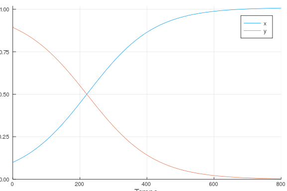
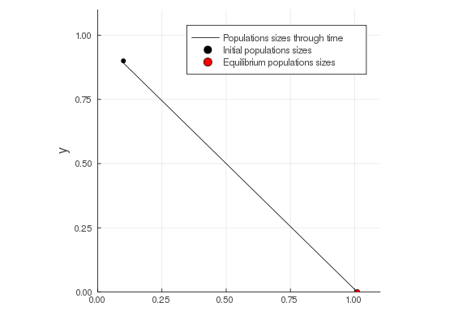
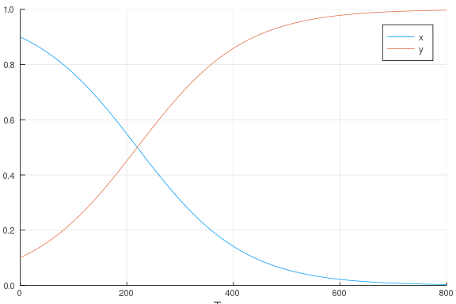
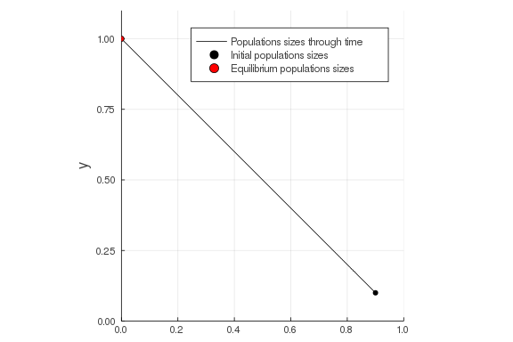
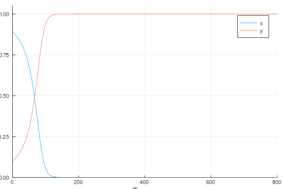
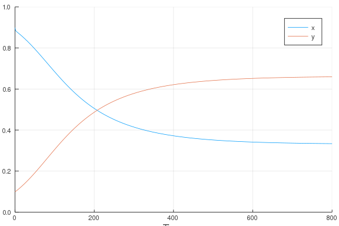
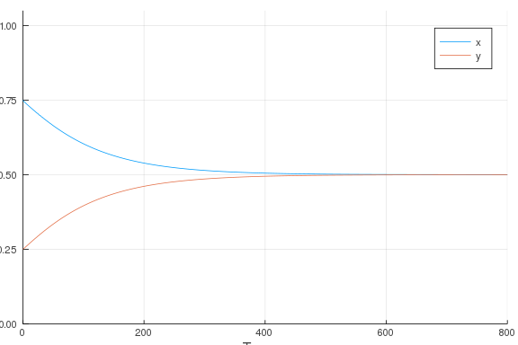
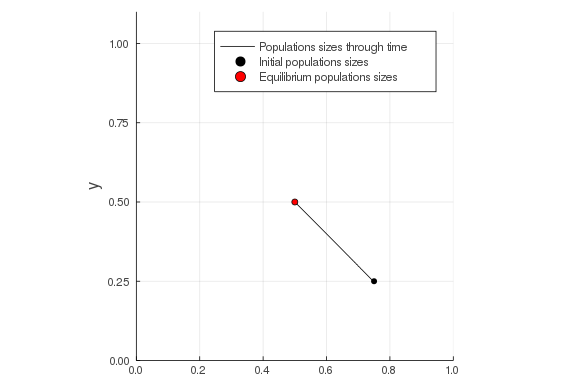
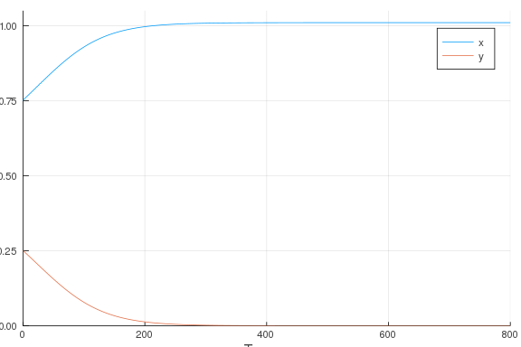
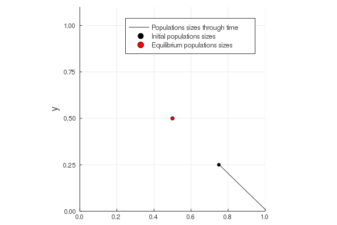

# Introduction

The logistic model of growth for two populations with intra and inter-specific competition can be thought as an extention to the logistic model of growth for one population with only intra-specific competition. In this latter, the intra-specific competition increases with the rate of encounters between individuals from the same species and causes a proportional reduction on the population growth rate. The effect of inter-specific competition can be modelled the same way, as decrease on population growth rate that is proportional to the rate of encounters between individuals from the given population with individuals from a competing population.

In a system with two populations experiencing intra and inter-specific competition, 2 generic outcomes can arrise: one of the two populations survives and the other goes extinct, leading to an equilibrium with only one species; both populations survive, leading to an equilibrium with two species. The occurrence of these states will depend on the values of the relative populations intrinsec growth rates and the intra and inter-specific competition coefficients.

In this work, we will define when the equilibriums with 1 and 2 species are feasible and visually explore these two generic types of outcomes enabled by the model by running simulations with different values of parameters.

## Required packages


````julia
using Plots
using DifferentialEquations
````


## Model description and justification

The logistic model of growth with intra and inter-specific competition for the two competing populations $x$ and $y$ can be given by

$$ \frac{d}{dt}x = R\times x - A\times x^2 - B\times x\times y $$

$$\frac{d}{dt}y = r\times y - a\times y^2 - b\times x\times y $$

where $\frac{d}{dt}x$ and $\frac{d}{dt}y$ represents the growth rate for population $x$ and $y$, respectively; $R$ and $r$ their intrinsec growth rates; $A$ and $a$ their intra-specific competition coefficients and, finally, $B$ and $b$ their inter-specific competition coefficients.

The populations intrinsec growth depends only on the population size itself (an assumption of the model is the occurrence of asexual or parthenogenic reproduction). On the other hand, the intraspecific competition depends on the rate of encounters between individuals from the same population, as well as the interspecific competition depends on the rate of encounters between individuals from different populations. 

Since the terms $(R\times x)$ and $(r\times y)$ - that represent the potential exponential growth rates of $x$ and $y$ - are positively adding to populations size variation and since the terms $(A\times x^2)$, $(a\times y^2)$, $(B\times x\times y)$ and $(b\times x\times y)$ - that consist of the negative effect of competition on populations size - are being subtracted from it, all the equations coefficients are positive.

## Model analysis

### Expressions of the zero-growth isoclines

The zero-growth isoclines are curves that indicate when one variable remains constant in function of values from the other variable. They can be found for each variable equalling $\frac{d}{dt}$ for that variable to zero.

#### For population x

When $ \frac{d}{dt}x = 0$, $ R\times x - A\times x^2 - B\times x\times y = 0$, which can simplified to $ R - A\times x - B\times y = 0$ and, with further arrangements, to $$ x = \frac{-B}{A}y + \frac{R}{A} $$.

#### For population y

When $ \frac{d}{dt}y = 0$, $ r\times y - a\times y^2 - b\times x\times y = 0$, which can simplified to $ r - a\times y - b\times x = 0$ and, with further arrangements, to $$ y = \frac{-b}{a}x + \frac{r}{a} $$.

### Identification of the equilibrium points

As a continuous time model, the equilibrium points $\hat x$ and $\hat y$ can be found when $\frac{d}{dt}x$ and $\frac{d}{dt}y$ are equal to zero (i.e., there is no change on population sizes).

#### Populations x and y absent

When both $x$ and $y$ are zero, $\frac{d}{dt}x$ and $\frac{d}{dt}y$ also equal zero. So, $\hat x = 0$ and $\hat y = 0$ is an equilibrium point of the model.

#### Population x present and population y absent

When $y = 0$, $ \frac{d}{dt}x = R\times x - A\times x^2 $. So, for $\frac{d}{dt}x = 0$, we get that $ R\times x - A\times x^2 = 0$, which can be simplified to $ R - A\times x = 0$ and further to $x = \frac{R}{A}$.

So, $\hat x = \frac{R}{A}$ and $\hat y = 0$ is an equilibrium point of the model.

#### Population x absent and population y present

When $x = 0$, $ \frac{d}{dt}y = r\times y - a\times y^2 $. So, for $\frac{d}{dt}y = 0$, we get that $ r\times y - a\times y^2 = 0$, which can be simplified to $ r - a\times y = 0$ and further to $y = \frac{r}{a}$.

So, $\hat x = 0$ and $\hat y = \frac{r}{a}$ is an equilibrium point of the model.

#### Population x and population y present

When both $x$ and $y$ are present, $ x = \frac{-B}{A}y + \frac{R}{A} $ and $ y = \frac{-b}{a}x + \frac{r}{a} $ happen simultaneously. So, to aknowledge this equilibrium point value, we can substitute $x$ in the $y$ zero-growth isocline for the $x$ zero-growth isocline expression and vice versa. 

From $ y = \frac{-b}{a}(\frac{-B}{A}y + \frac{R}{A}) + \frac{r}{a} $, we get that $y = \frac{Ar - bR}{aA - bB}$. From $ x = \frac{-B}{A}(\frac{-b}{a}x + \frac{r}{a}) + \frac{R}{A} $, we get that $x = \frac{aR - Br}{aA - bB}$.

So, $\hat x = \frac{aR - Br}{aA - bB}$ and $\hat y = \frac{Ar - bR}{aA - bB}$ is an equilibrium point of the model.

### Faisibility conditions

For the equilibrium points to be faisible, they have to be equal or greater than zero.

#### Populations x and y absent

The equilibrium point $\hat x = 0$ and $\hat y = 0$ is faisible, as $\hat x$ and $\hat y$ equal zero.

#### Population x present and population y absent

To the equilibrium point $\hat x = \frac{R}{A}$ and $\hat y = 0$ to be faisible, $\frac{R}{A}$ has to be greater than zero. As both $R$ and $A$ are positive, this equilibrium point is faisible.

#### Population x absent and population y present

To the equilibrium point $\hat x = 0$ and $\hat y = \frac{r}{a}$ to be faisible, $\frac{r}{a}$ has to be greater than zero. As both $r$ and $a$ are positive, this equilibrium point is faisible.

#### Population x and population y present

To the equilibrium point $\hat x = \frac{aR - Br}{aA - bB}$ and $\hat y = \frac{Ar - bR}{aA - bB}$ to be faisible, $\frac{aR - Br}{aA - bB}$ and $\frac{Ar - bR}{aA - bB}$ have to be greater than zero. To a quotient to be positive, numerator and denominator must have equal signs. As the equations for $x$ and $y$ share the same denominator, we can evaluate the faisibility for this equilibrium point in two steps:

1) ${aA - bB} > 0$, which can be rewritten as $\frac{a}{B} > \frac{b}{A}$:

In this case, $aR - Br > 0$, which can be rewritten as $\frac{r}{R} < \frac{a}{B}$. Also, $Ar - bR > 0$, which can be rewritten as $\frac{r}{R} > \frac{b}{A}$. So,  $\frac{b}{A} < \frac{r}{R} < \frac{a}{B}$.

2) ${aA - bB} < 0$, which can be rewritten as $\frac{a}{B} < \frac{b}{A}$:

In this case, $aR - Br < 0$, which can be rewritten as $\frac{r}{R} < \frac{a}{B}$. Also, $Ar - bR < 0$, which can be rewritten as $\frac{r}{R} < \frac{b}{A}$. So,  $\frac{b}{A} > \frac{r}{R} > \frac{a}{B}$.

In both cases, the condition given by the denominator $aA - bB$ is included in the conditions stated by the numerators.

*To summarize*, we have that for the equilibrium point with both populations $x$ and $y$ present, one of either conditions must hold: $\frac{b}{A} < \frac{r}{R} < \frac{a}{B}$ or $\frac{b}{A} > \frac{r}{R} > \frac{a}{B}$.

## Simulations

To visually verify the different types of outcomes in relation to the system's equilibrium points, we can run simulations with varing values of parameters.

We can start by generating the model function.


````julia
function competition(u0, p, t) # creates function with parameters u0, p and t
    x, y = u0 # attributes u0 values as initial populations sizes to x and y
    dx = p.R*x - p.A*x*x - p.B*x*y # models dN/dt for population x
    dy = p.r*y - p.a*y*y - p.b*x*y # models dN/dt for population y
    return [dx, dy] # returns dx/dt and dy/dt as the function result
end # ends the function
````


````
competition (generic function with 1 method)
````


After that, we can create functions to calculate the equilibrium points of the system when there is only one of the two populations left and when both populations are greater than zero.


````julia
function eq_1_sp(p,sp) # creates function with parameters p and sp (this parameter receives the information about which population had survived)
    if sp == "x" # gives the condition: if the population that survives is x
        x̂ = p.R/p.A # calculates the equilibrium value of x when y is absent
        return (x̂,0) # returns the x̂ calculated above and the equilibrium point ŷ = 0
    else # gives the condition: if the population that survives is not x (i.e, if it is y)
        ŷ = p.r/p.a # calculates the equilibrium value of y when x is absent
        return (0,ŷ) # returns the ŷ calculated above and the equilibrium point x̂ = 0
    end # ends the conditional evaluation
end # ends the function

function eq_2_sp(p) # creates function with parameters p
    k = p.B*p.b-p.A*p.a
    x̂ = (p.B*p.r - p.R*p.a)/k # calculates x̂ for when both x and y equilibrium population sizes are greater than zero
    ŷ = (p.b*p.R - p.r*p.A)/k # calculates ŷ for when both x and y equilibrium population sizes are greater than zero
    return (x̂, ŷ) # returns x̂ and ŷ as the function result
end # ends the function
````


````
eq_2_sp (generic function with 1 method)
````


#### Population x present and population y absent

For our first simulation, we can attribute the same value to the intrinsec growth rate for both $x$ and $y$, as well as to the inter-specific competition coefficient, varying only the intra-specific competition coefficient between the two populations and their initial population sizes.


````julia
# Initial population sizes
u0 = [0.1, 0.9]
# t0 - t end
t = (0., 800.)
# Parameters
p = (r=1., R=1., a=1.01, A=0.99, b=1., B=1.)

# Definition du problème
prob = ODEProblem(competition, u0, t, p)
# Résolution du problème
solution = solve(prob)

# Plot
plot(solution, ylim=(0,1.02), xlab="Tempo", ylab="Population size",label=["x" "y"])
````





From the first graph, we can see that population $y$, which has a greater value for the intra-competition coefficient, decreases until its extinction, while population $x$ increases until it reaches the equilibrium value of $\frac{R}{A}$ (which, in this example, is approximately 1,01). From the graph below, we can check the size variation of one population in relation to the other through the time span used in the simulation.


````julia
# Plot
plot(solution, label="Populations sizes through time", c=:black, vars=(1,2), xlab="x", ylab="y", aspectratio=1, xlim=(0,1.1), ylim=(0,1.1))
scatter!([u0[1]], [u0[2]], c=:black, lab="Initial populations sizes")
scatter!(eq_1_sp(p,"x"),c=:red,lab="Equilibrium populations sizes")
````





#### Population x absent and population y present

In relation to the previous simulation, if we increase $y$ intrinsec growth rate $r$ and decrease $x$ intrinsec growth rate $R$, the outcome of the simulation will change.


````julia
# Initial population sizes
u0 = [0.9, 0.1]
# t0 - t end
t = (0., 800.)
# Parameters
p = (r=1.01, R=0.99, a=1.01, A=0.99, b=1., B=1.)

# Definition du problème
prob = ODEProblem(competition, u0, t, p)
# Résolution du problème
solution = solve(prob)

# Plot
plot(solution, ylim=(0,1), xlab="Tempo", ylab="Population size",label=["x" "y"])
````





With a lower value of $R$, population $x$ decreases until its extinction while population $y$ increases until it reaches the equilibrium value of $\frac{r}{a}$ (which, in this example, equals 1). From the graph below, we can check the size variation of one population in relation to the other through the time span used in the simulation.


````julia
# Plot
plot(solution, label="Populations sizes through time", c=:black, vars=(1,2), xlab="x", ylab="y", aspectratio=1, xlim=(0,1), ylim=(0,1.1))
scatter!([u0[1]], [u0[2]], c=:black, lab="Initial populations sizes")
scatter!(eq_1_sp(p,"y"),c=:red,lab="Equilibrium populations sizes")
````





If we now increase the value of the inter-specific competition suffered by $x$ (given by $B$), we get to the same outcome as the previous simulation, but faster.


````julia
# Initial population sizes
u0 = [0.9, 0.1]
# t0 - t end
t = (0., 800.)
# Parameters
p = (r=1.01, R=0.99, a=1.01, A=0.99, b=1.0, B=1.1)

# Definition du problème
prob = ODEProblem(competition, u0, t, p)
# Résolution du problème
solution = solve(prob)

# Plot
plot(solution, ylim=(0,1.05), xlab="Tempo", ylab="Population size",label=["x" "y"])
````





#### Population x and population y present

If we come back to the first simulation (with both intrinsec growth rates and both inter-specific competition coefficients valued as $1.0$) and increase the $x$ intra-specific competition coefficient $A$ to $1.02$ (now greater than $a$, valued as $1.01$), the outcome of the system will change, leading to a state where both populations have equilibrium sizes greater than zero.


````julia
# Initial population sizes
u0 = [0.9, 0.1]
# t0 - t end
t = (0., 800.)
# Parameters
p = (r=1., R=1., a=1.01, A=1.02, b=1., B=1.)

# Definition du problème
prob = ODEProblem(competition, u0, t, p)
# Résolution du problème
solution = solve(prob)

# Plot
plot(solution, ylim=(0,1), xlab="Time", ylab="Population size",label=["x" "y"])
````





In this case, we can see that the condition $\frac{b}{A} < \frac{r}{R} < \frac{a}{B}$ for the equilibrium with two species is hold, as $\frac{b}{A}$ is lesser than 1 ($=\frac{1}{1.02}$), $\frac{r}{R}$ equals 1 and $\frac{a}{B}$ is greater than 1 ($=\frac{1.01}{1}$). From the graph below, we can check the size variation of one population in relation to the other through the time span used in the simulation, and verify that the equilibrium populations sizes are greater than zero for both populations.


````julia
# Plot
plot(solution, label="Populations sizes through time", c=:black, vars=(1,2), xlab="x", ylab="y", aspectratio=1, xlim=(0,1), ylim=(0,1.1))
scatter!([u0[1]], [u0[2]], c=:black, lab="Initial populations sizes")
scatter!(eq_2_sp(p),c=:red,lab="Equilibrium populations sizes")
````


#### Population x and population y present: stability of the equilibrium point

Exploring parameter values and model outcomes, we can suppose that the condition $\frac{b}{A} < \frac{r}{R} < \frac{a}{B}$ for the equilibrium with 2 species, when met, produces a stable equilibrium point. In the example below, in which the two populations have identical parameter values, $\frac{b}{A}$ is lesser than 1, $\frac{r}{R}$ equals 1 and $\frac{a}{B}$ is greater than 1. When the two populations have different initial sizes, both of them will converge to the equilibrium point (here, the equilibrium sizes are the same for both populations, as they  are identical), indicating its stability.


````julia
# Initial population sizes
u0 = [0.75,0.25]
# t0 - t end
t = (0., 800.)
# Parameters
p = (r=1., R=1., a=1.01, A=1.01, b=0.99, B=0.99)

# Definition du problème
prob = ODEProblem(competition, u0, t, p)
# Résolution du problème
solution = solve(prob)

# Plot
plot(solution, ylim=(0,1.05), xlab="Tempo", ylab="Population size",label=["x" "y"])
````




````julia
# Plot
plot(solution, label="Populations sizes through time", c=:black, vars=(1,2), xlab="x", ylab="y", aspectratio=1, xlim=(0,1), ylim=(0,1.1))
scatter!([u0[1]], [u0[2]], c=:black, lab="Initial populations sizes")
scatter!(eq_2_sp(p),c=:red,lab="Equilibrium populations sizes")
````





On the other hand, the other possible condition for the equilibrium with 2 species, given by $\frac{b}{A} > \frac{r}{R} > \frac{a}{B}$, produces an unstable equilibrium point when met. In the example below, in which the two populations are also identical but with $\frac{b}{A}$ greater than 1, $\frac{r}{R}$ equaling 1 and $\frac{a}{B}$ less than 1, populations will diverge from the equilibrium point, indicating its unstability. For the given example, when the two populations have different initial sizes, the surving species will be the one with greater initial population size.


````julia
# Initial population sizes
u0 = [0.75,0.25]
# t0 - t end
t = (0., 800.)
# Parameters
p = (r=1., R=1., a=0.99, A=0.99, b=1.01, B=1.01)

# Definition du problème
prob = ODEProblem(competition, u0, t, p)
# Résolution du problème
solution = solve(prob)

# Plot
plot(solution, ylim=(0,1.05), xlab="Tempo", ylab="Population size",label=["x" "y"])
````




````julia
# Plot
plot(solution, label="Populations sizes through time", c=:black, vars=(1,2), xlab="x", ylab="y", aspectratio=1, xlim=(0,1), ylim=(0,1.1))
scatter!([u0[1]], [u0[2]], c=:black, lab="Initial populations sizes")
scatter!(eq_2_sp(p),c=:red,lab="Equilibrium populations sizes")
````





We can try to interpret these conditions and outcomes in a biological way. In both cases shown, species are identical, but in the first one (which produces a stable equilibrium point) the intra-specific competition coefficients are greater than the inter-specific ones. In  the second example, where the equilibrium point is unstable, the inter-specific competition coefficients are greater than the intra-specific ones. We can conclude that for two populations to stably coexist, the negative effect of both species over themselves have to be greater than their negative effect over each other.

## Conclusions

The logistic model of growth for two populations with intra and inter-specific competition can generate equilibrium states that differ in the quantity and the identity of the surviving species, as well as in their population sizes, depending on the relative values of the intrinsec growth rates and the intra and inter-specific competition coefficients. Also, the stability of the equilibrium point with two species depends as well on these relative values. From this study, we can see that a simple model as the logistic can be used to evaluate the local diversity and the coexistence potential of competing species. 
