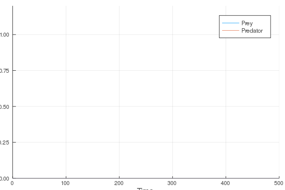
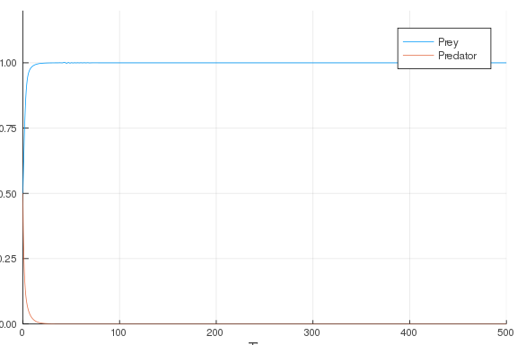
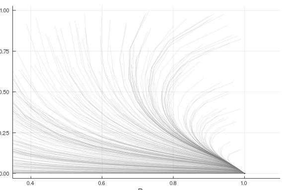
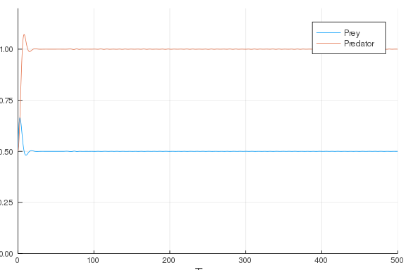
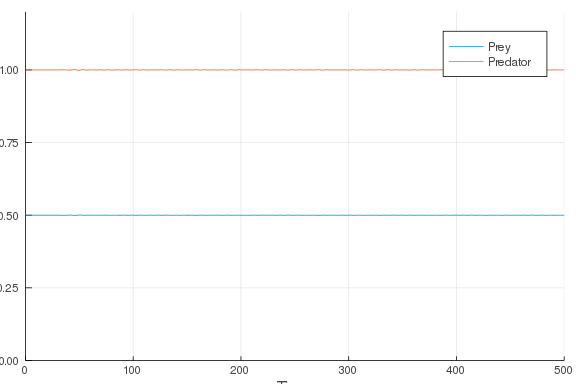
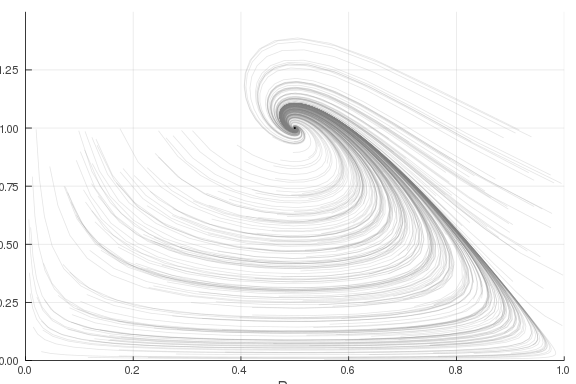

# Introduction

The dynamics of prey and predator populations can generate different outcomes depending on population values for reproduction, death and predation rates and for competition coefficients. The specific conditions for the outcomes to arise can be explored mathematically and by simulation, which can lead to a better understanding of the biological mechanisms of the populations interaction. In this assignment, we will model a predator-prey interaction, discuss the stability of the different equilibriums, and test our analytical results by performing simulations in which the population sizes are moved away from the equilibrium by a small amount.

## Required packages


````julia
using Plots
using DifferentialEquations
````


## Model description and justification

The predator-prey model can be given by 

$$ \frac{d}{dt}x = r\times x - a\times x^2 - b\times x\times y $$

$$\frac{d}{dt}y = g\times x\times y - d\times y $$

where $\frac{d}{dt}x$ and $\frac{d}{dt}y$ represents the growth rates for prey population $x$ and predator population $y$, respectively; $r$ represents the intrinsec growth rate of prey population, $a$ its intra-specific competition coefficient and $b$ the predation coefficient (determined by the encounter rate with predator y); finally, $g$ represents the predator intrinsec growth rate, which depends on the encounter rate with prey population $x$ (the only food resource for the predator), and $d$ the death rate for the predator $y$.

## Model analysis

### Identification of the equilibrium points

As a continuous time model, the equilibrium points $\hat x$ and $\hat y$ can be found when $\frac{d}{dt}x$ and $\frac{d}{dt}y$ are equal to zero (i.e., there is no change on population sizes).

#### Populations x and y absent

When both $x$ and $y$ are zero, $\frac{d}{dt}x$ and $\frac{d}{dt}y$ also equal zero. So, $\hat x = 0$ and $\hat y = 0$ is an equilibrium point of the model.

#### Population x absent and population y present

There is no $\hat y$ greatest than zero when $\hat x$  equals zero, as the growth of the predator population $y$ depends entirely on the prey population $x$. So, there is no equilibrium point such that population $x$ is absent and population $y$ is present.

#### Population x present and population y absent

When $y = 0$, $ \frac{d}{dt}x = r\times x - a\times x^2 $. So, for $\frac{d}{dt}x = 0$, we get that $ r\times x - a\times x^2 = 0$, which can be simplified to $ r - a\times x = 0$ and further to $x = \frac{r}{a}$.

So, $\hat x = \frac{r}{a}$ and $\hat y = 0$ is an equilibrium point of the model.

#### Population x and population y present

When both $x$ and $y$ are greater than zero at an equilibrium point, equations $$ 0 = r\times x - a\times x^2 - b\times x\times y $$ $$0 = g\times x\times y - d\times y $$ must hold simultaneously. They can be simplified to $$ 0 = r - a\times x - b\times y $$ $$ 0 = y (g\times x - d) $$ then further to $$ b\times y = r - a\times x $$ $$ g\times x = d $$ and to $$ y = \frac{r}{b} - \frac{a}{b}x$$ $$ x = \frac{d}{g}. $$ If we replace the second equation into the first, we get to $$ y = \frac{r}{b} - \frac{a}{b} \times \frac{d}{g}.$$ So, $\hat x = \frac{d}{g}$ and $\hat y = \frac{r}{b} - \frac{a}{b} \times \frac{d}{g}$ is an equilibrium point of the model.

### Feasibility conditions

For the equilibrium points to be feasible, they have to be equal or greater than zero.

#### Equilibrium point $\hat x = 0$ and $\hat y = 0$ (populations x and y absent)

This equilibrium point is feasible, as $\hat x$ and $\hat y$ can equal zero.

#### Equilibrium point $\hat x = \frac{r}{a}$ and $\hat y = 0$ (population x present and population y absent)

To this equilibrium point to be feasible, the condition $\frac{r}{a} > 0$ must hold.

#### Equilibrium point $\hat x = \frac{d}{g}$ and $\hat y = \frac{r}{b} - \frac{a}{b} \times \frac{d}{g}$ (populations x and y present)

To this equilibrium point to be feasible, the conditions $\frac{d}{g} > 0$ and $\frac{r}{b} - \frac{a}{b} \times \frac{d}{g} > 0 $ must hold. We can simplify the second equation to $\frac{r}{b} > \frac{a}{b} \times \frac{d}{g}$, then to $r > \frac{ad}{g}$ and further to $ \frac{r}{a} > \frac{d}{g}$. 
Considering both equations, we get that the feasibility condition to this equilibrium point is $ \frac{r}{a} > \frac{d}{g} > 0$.

### Stability of the equilibrium points

To analyze the local stability of the equilibrium points of this predator-prey model (which is a nonlinear multivariable model in continuous time), we can calculate the Jacobian matrix and evaluate it at each equilibrium point.

The Jacobian matrix of a model can be calculated by taking the derivative of each equation function with respect to each variable. Each row is assigned to a function and each column is assigned to a variable. As on population models there is one function to describe how each population changes, the Jacobian matrix will be squared.

The Jacobian matrix evaluated at an equilibrium point provides a linear approximation of the non-linear model near that equilibrium, which means we can calculate or get information about its eigenvalues and verify if the condition for an equilibrium point to be stable holds. The equilibrium is locally stable if the real part of all its eigenvalues are negative, meaning that the system of equations will shrink towards the equilibrium point.

Using a linear algebra rule, we can state that when the determinant of a 2x2 matrix is positive and its trace is negative, the real parts of both of its eigenvalues will be negative.

#### The Jacobian matrix J for our model

$$ J = \begin{array} /\frac{\partial f(x)}{\partial x} & \frac{\partial f(x)}{\partial y}\\\frac{\partial f(y)}{\partial x} & \frac{\partial f(y)}{\partial y} \end{array},$$
where $f(x) = \frac{d}{dt}x$ and $f(y) = \frac{d}{dt}y$.

Taking the derivatives, we get to $$ J = \begin{array} /r - 2ax - by & -bx\\gy & gx - d \end{array}$$

A given equilibrium point is stable if $ Tr(J) = J_{11} + J_{22} < 0 $ and $ Det(J) = J_{11} \times J_{22} - J_{12} \times J_{21} > 0$, for J evaluated at that point. 

#### Equilibrium point $\hat x = 0$ and $\hat y = 0$ (populations x and y absent)

Evaluating J at this equilibrium point, we get that $ J = \begin{array} /r & 0\\0 & - d \end{array}$. 

$Tr(J) = r - d$ and  $Det(J) = - r \times d$, so the conditions for this equilibrium point to be stable are: $r - d < 0$, which simplifies to $r < d$, and $- rd > 0$, which is impossible, as both $r$ and $d$ are positive coefficients and when multiplied by $-1$ can not generate a positive number.

So, the $\hat x = 0$ and $\hat y = 0$ equilibrium point is unstable.

#### Equilibrium point $\hat x = \frac{r}{a}$ and $\hat y = 0$ (population x present and population y absent)

Evaluating J at this equilibrium point, we get that $ J = \begin{array} /-r & \frac{-br}{a}\\0 & \frac{gr}{a} - d \end{array} $.

$Tr(J) = -r + \frac{gr}{a} - d$, so one of the conditions for this equilibrium point to be stable is: $-r + \frac{gr}{a} - d < 0$, which can be written as $r + (-\frac{gr}{a} + d) > 0$.

$Det(J) = -r (\frac{gr}{a} - d)$, so the other condition for the equilibrium point to be stable is: $-r (\frac{gr}{a} - d) > 0$, which can be written as $r (-\frac{gr}{a} + d) > 0$.

Looking to the second condition and assuming that $r$ is positive, we can simplify it to $(-\frac{gr}{a} + d) > 0$. If $(-\frac{gr}{a} + d) > 0$, than the first condition is also hold (as the sum of two positive numbers can only result in a positive value). So, the first and the second conditions can be summarized by $(-\frac{gr}{a} + d) > 0$.

If we simplify it, we get to $-\frac{gr}{a} > -d$, than to $-gr > -ad$, further to $gr < ad$ and finally to $\frac{r}{a} < \frac{d}{g}$.

So, the equilibrium point $\hat x = \frac{r}{a}$ and $\hat y = 0$ is stable if $\frac{r}{a} < \frac{d}{g}$.

#### Equilibrium point $\hat x = \frac{d}{g}$ and $\hat y = \frac{r}{b} - \frac{a}{b} \times \frac{d}{g}$ (populations x and y present)

Evaluating J at this equilibrium point, we get that $ J = \begin{array} /\frac{-ad}{g} & \frac{-bd}{g}\\ \frac{rg-ad}{b} & 0 \end{array}$.

$Tr(J) = \frac{-ad}{g}$, so one of the conditions for this equilibrium point to be stable is: $\frac{-ad}{g} < 0$, which is always true, as the coefficients $a$, $d$ and $g$ are positive.

$Det(J) = -(\frac{-bd}{g}(\frac{rg-ad}{b}))$, which can be simplified to $Det(J) = d(r - \frac{ad}{g})$. So the other condition for the equilibrium point to be stable is: $d(r - \frac{ad}{g}) > 0$, which can be simplified to $r - \frac{ad}{g} > 0$ (as $d$ is positive) and be written as $\frac{r}{a} > \frac{d}{g}$.

So, the equilibrium point $\hat x = \frac{d}{g}$ and $\hat y = \frac{r}{b} - \frac{a}{b} \times \frac{d}{g}$ is stable if $\frac{r}{a} > \frac{d}{g}$.

Looking back to this equilibrium point feasibility condition, which is given by $ \frac{r}{a} > \frac{d}{g} > 0$, and comparing it to its stability condition, which is given by $\frac{r}{a} > \frac{d}{g}$, we can state that this equilibrium point, when achivable, is always stable.

## Simulations

We can simulate populations with different parameter values to illustrate our equilibrium points stability analysis.
We will start by creating a function that contains our model and another to calculate the equilibrium point given a set of parameter values.


````julia
function predation(u0, p, t) # creates function predation with parameters u0, p and t
    x, y = u0 # the parameter u0 will set x and y initial population sizes
    dx = p.r*x - p.a*x*x - p.b*x*y # models the change on prey population x
    dy = p.g*x*y - p.d*y # models the change on predator population y
    return [dx, dy] # returns dx and dy as the function result
    end # ends the function predation

function eq(p) # creates function eq with parameter p
    if p.r/p.a < p.d/p.g # sets a condition: if r/a < d/g (which is the stability condition for the equilibrium with only the prey)
        x̂ = p.r/p.a # calculates the equilibrium population size for the prey
        ŷ = 0 # sets the equilibrium population size for the predator as zero
        else # if r/a > d/g (which is the stability condition for the equilibrium with prey and predator)
        x̂ = p.d/p.g # calculates the equilibrium population size for the prey
        ŷ = (p.r/p.b) - (p.a*p.d)/(p.b*p.g) # calculates the equilibrium population size for the predator
        end # ends the conditional evaluation
    return (x̂,ŷ) # returns x̂ and ŷ as the function result
end # ends the function eq
````


````
eq (generic function with 1 method)
````


#### Equilibrium point $\hat x = 0$ and $\hat y = 0$ (populations x and y absent)

If we create a scenario with prey and predator population sizes initially set as zero, we will see no variation in both population sizes over time. This makes sense mathematically and biologically, as $\hat x = 0$ and $\hat y = 0$ is an equilibrium point of the system and no new individual can appear on these populations other than by reproduction from existing individuals.


````julia
# t0 - t end
t = (0., 500.)

# Initial population sizes
u0 = [0., 0.]

# Parameters
p = (r=1.0, a=1.0, b=0.5, g=1., d=1.2)
# Definition du problème
prob = ODEProblem(predation, u0, t, p)
# Résolution du problème
solution = solve(prob)
# Plot
plot(solution,ylim=(0,1.2),label=["Prey" "Predator"],xlab="Time", ylab="Population size")
````





However, if we increase both population sizes by a small amount, we can see that the system will diverge from this equilibrim point, showing its unstability. 

````julia
equil_pert = u0 .+ rand(2).*1e-5 # adds a perturbation to the initial population sizes (which were at the equilibrium (x̂,ŷ)=(0,0))
prob_pert = ODEProblem(predation, equil_pert, t, p) # uses this new population sizes to set the model
sol_prob_pert = solve(prob_pert) # runs the model
plot(sol_prob_pert,ylim=(0,1.2),label=["Prey" "Predator"],xlab="Time", ylab="Population size") # plots the result in a population size x time graph
````


#### Equilibrium point $\hat x = \frac{r}{a}$ and $\hat y = 0$ (population x present and population y absent)

Another thing we could follow from the result shown on the last graph was that the prey population, rising from close to zero, grew to a certain value. This same result will take place if we change the initial sizes for both populations.


````julia
# Initial population sizes
u0 = [0.5, 0.5]

# Parameters
p = (r=1.0, a=1.0, b=0.5, g=1., d=1.2)
# Definition du problème
prob = ODEProblem(predation, u0, t, p)
# Résolution du problème
solution = solve(prob)
# Plot
plot(solution,ylim=(0,1.2),label=["Prey" "Predator"],xlab="Time", ylab="Population size")
````





This result is consistent no matter the initial populations sizes, which can be verified by running various simulations with random initial population sizes and plotting the relation between the prey and the predator population sizes established over time.

````julia
# Steamplot
pl_st = plot()
for model_run in 1:300
    prob = ODEProblem(predation, rand(2), t, p)
    sol = solve(prob)
    plot!(pl_st, sol, vars=(1,2), leg=false, c=:gray, alpha=0.2)
end

xaxis!(pl_st, "Prey")
yaxis!(pl_st, "Predator")
scatter!(pl_st, eq(p), c=:black, markersize=2)
````





The value reached by the prey population is given by $\frac{r}{a}$, which in this example results in one ($1/1 = 1$). The stability of this equilibrium point can be shown by moving away both population sizes from their equilibrium values by a small amount and running the model again. This happens because the condition for its stability, which is $\frac{r}{a} < \frac{d}{g}$, was satisfied, as $\frac{1}{1} < \frac{1.2}{1}$

````julia
equil = eq(p)
equil_pert = equil .+ rand(2).*1e-5
prob_pert = ODEProblem(predation, equil_pert, t, p)
sol_prob_pert = solve(prob_pert)
plot(sol_prob_pert,ylim=(0,1.2),label=["Prey" "Predator"],xlab="Time", ylab="Population size")
````


#### Equilibrium point $\hat x = \frac{d}{g}$ and $\hat y = \frac{r}{b} - \frac{a}{b} \times \frac{d}{g}$ (populations x and y present)

If, however, parameter values are set in a way that $\frac{r}{a} > \frac{d}{g}$, we create the conditions for the predator to arise and coexist with the prey, even though the latter will stabilize in a population size smaller than the scenario without the predator.


````julia
# Initial population sizes
u0 = [0.5, 0.5]

# Parameters
p = (r=1.0, a=1.0, b=0.5, g=1., d=0.5)
# Definition du problème
prob = ODEProblem(predation, u0, t, p)
# Résolution du problème
solution = solve(prob)
# Plot
plot(solution,ylim=(0,1.2),label=["Prey" "Predator"],xlab="Time", ylab="Population size")
````





The value reached by the prey population is given by $\frac{d}{g}$, which in this example results in 0.5 ($\frac{0.5}{1} = 0.5$), and the value reached by the predator is given by $\hat y = \frac{r}{b} - \frac{a}{b} \times \frac{d}{g}$, which here results in 1.0 ($\frac{1}{0.5} - \frac{1}{0.5} \times \frac{0.5}{1}$ = $2-1$ = $1$).

The stability of this equilibrium point can be shown by moving away both population sizes from their equilibrium values by a small amount and running the model again, which will result in a recovery of the equilibrium values. This happens because the condition for its stability, which is $\frac{r}{a} > \frac{d}{g}$, was satisfied, as $\frac{1}{1} > \frac{0.5}{1}$.

````julia
equil = eq(p)
equil_pert = equil .+ rand(2).*1e-5
prob_pert = ODEProblem(predation, equil_pert, t, p)
sol_prob_pert = solve(prob_pert)
plot(sol_prob_pert,ylim=(0,1.2),label=["Prey" "Predator"],xlab="Time", ylab="Population size")
````





This result is also consistent regardless of the initial populations sizes.

````julia
pl_st = plot()
for model_run in 1:300
    prob = ODEProblem(predation, rand(2), t, p)
    sol = solve(prob)
    plot!(pl_st, sol, vars=(1,2), leg=false, c=:gray, alpha=0.2)
end

xaxis!(pl_st, "Prey", (0,1.))
yaxis!(pl_st, "Predator", (0,1.5))
scatter!(pl_st, eq(p), c=:black, markersize=2)
````





## Conclusions

The predator-prey model - in which there is intraspecific competition for the prey and in which the predator gets all of its resources to reproduce from the prey species - can generate three different outcomes:

1) absence of both populations, an unstable equilibrium state that can be unsettled by the addition of a single prey individual. No new individual can appear on the populations other than by reproduction from existing individuals, yet from the moment the prey population gets positive (even if it has only one individual), it will start reproducing and grow;

2) presence of the prey population and absence of the predator, a stable equilibrium state that takes place when the relation between the mortality and the reproduction rate of the predator ($\frac{d}{g}$) is greater than the relation between the intrinsec growth rate and the intraspecific competition rate for the prey population ($\frac{r}{a}$). The greater comparative value of the predator's mortality makes it impossible for its population to sustain itself. This equilibrium state is stable as the population size reached by the prey is its carrying capacity, to which population shrinks or increases when starting above or bellow it, respectively;

3) presence of both the prey and the predator population, a stable equilibrium state that takes place when the relation between the mortality and the reproduction rate of the predator ($\frac{d}{g}$) is smaller than the relation between the intrinsec growth rate and the intraspecific competition rate for the prey population ($\frac{r}{a}$). With a lower comparative value of mortality, the predator population can be sustained and coexist with its prey population, that stabilizes in a lower size value. As the prey population is constrained by intraspecific competition, which means that they are limited by factors other than their predators, there is no tendency for the two populations to cycle.
